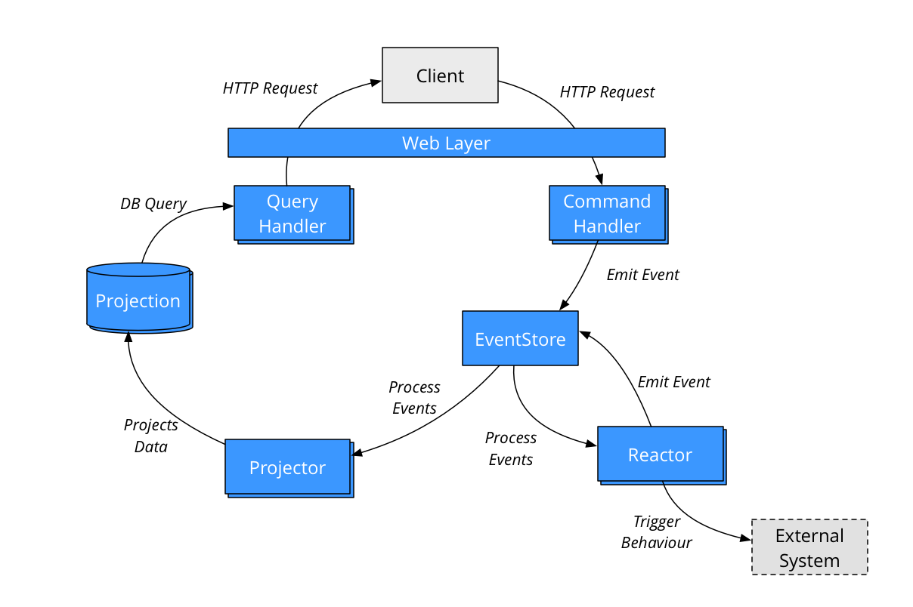
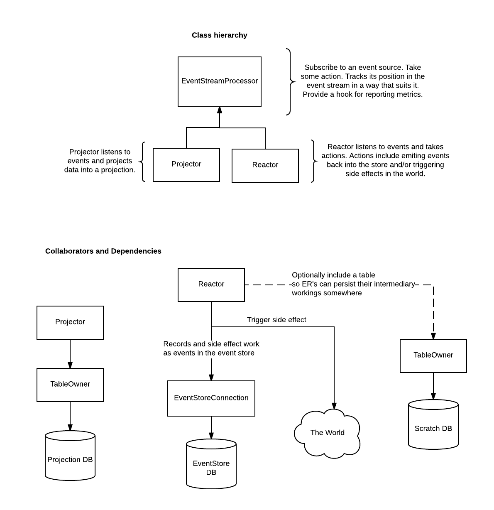
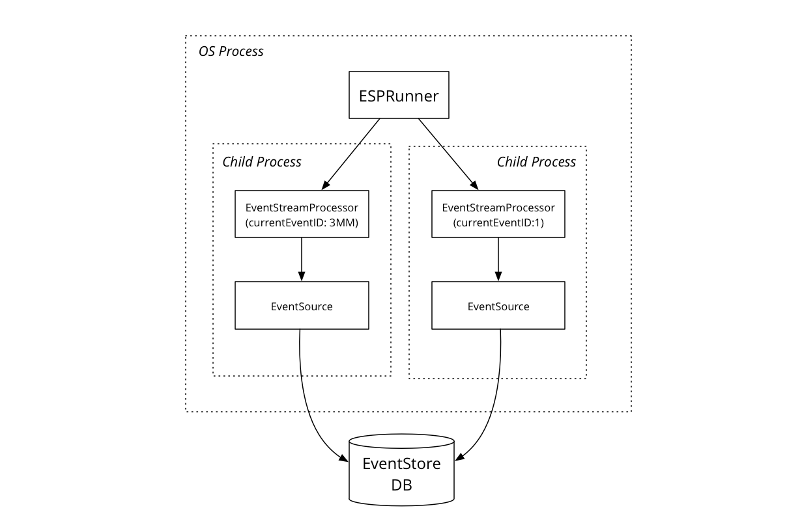

# EventSourcery Core Concepts

This document outlines some core concepts in EventSourcery.

Start off by reading about [CQRS](http://martinfowler.com/bliki/CQRS.html), [Event Sourcing](http://www.martinfowler.com/eaaDev/EventSourcing.html), and [Domain-Driven Design](https://en.wikipedia.org/wiki/Domain-driven_design).

## Tour of an EventSourcery Application

Below is a high level view of a CQRS, event-sourced application built using EventSourcery. The pieces in blue in the diagram below can be created using building blocks provided by EventSourcery.



## Web Layer

EventSourcery's primary channel for interacting with clients is via HTTP. EventSourcery uses Sinatra to provide a web layer in front of command and query handlers.

## Aggregates and Command Handling

> An aggregate is a cluster of domain objects that can be treated as a single unit. Every transaction is scoped to a single aggregate. An aggregate will have one of its component objects be the aggregate root. Any references from outside the aggregate should only go to the aggregate root. The root can thus ensure the integrity of the aggregate as a whole.
>
> <cite>— [DDD Aggregate](http://martinfowler.com/bliki/DDD_Aggregate.html)</cite>

Clients execute domain transactions against the system by issuing commands against aggregates.

The web layer will take a command and pass it to the appropriate command handler. The command handler instantiates the aggregate in question and defers to it to process the command.

When created, an aggregate loads its state by loading all events that pertain to it from the event store. The aggregate then processes the command by either rejecting it or accepting it. The aggregate emits events into the event store when it successfully processes a command.

## Events

Events are objects that record something of meaning in the domain. Think of a sequence of events as a time series of immutable domain facts.

Events are targeted at an aggregate via an `aggregate_id`, have a `type`, an identifier (`id`), a `created_at` date, and a payload (aka. `body`).

```ruby
module EventSourcery
  class Event
    include Virtus.value_object

    values do
      attribute :id, Integer
      attribute :aggregate_id, String
      attribute :type, String
      attribute :body, Hash
      attribute :created_at, Time
    end
  end
end
```

## The Event Store

The event store is a persistent store of events.

EventSourcery currently supports a Postgres-based event store.

### Storing Events

Naturally, it provides the ability to store events. The event store is append-only and immutable. The events in the store form a time-ordered sequence which can be viewed as a stream of events.

EventStore clients can optionally provide an expected version of event when saving to the store. This provides a mechanism for EventStore clients to effectively serialise the processing they perform against an instance of an aggregate.

### Reading Events

The event store also allows clients to read events. Clients can poll the store for events of specific types after a specific event ID. They can also subscribe to the event store to be notified when new events are added to the event that match the above criteria.

## Event Processing

A central part of EventSourcery is the processing of events in the store. We'll cover the concepts involved in event processing.



### Event Stream Processors

Event Stream Processors (ESPs) subscribe to an event store. They read events from the event store and take some action.

When newly created, an ESP will process the event stream from the beginning. When catching up like this an ESP can process events in batches (currently set to 1,000 events). This allows them to optimise processing as desired.

ESPs track the position in the event stream that they've processed in a way that suits them. This allows for them to optimise transaction handling in the case where they are catching up for example.

They provide an interface to report their position in the stream to upstream supervisors and monitors.

### Projectors

A Projector is an EventStreamProcessor that listens for events and projects data into a projection. These projections are generally consumed on the read side of the CQRS world.

Projectors tend to be built for specific read-side needs and are generally specific to a single read case.

Modifying a projection is achieved by creating a new projector.

### Reactors

A Reactor is an EventStreamProcessor that listens to events and emits events back into the store and/or trigger side effects in the world.

They typically record any external side effects they've triggered as events in the store.

### Running Multiple ESPs

An EventSourcery application will typically have multiple ESPs running. EventSourcery provides a class called [ESPRunner](https://github.com/envato/event_sourcery/blob/master/lib/event_sourcery/event_processing/esp_runner.rb) which can be used to run ESPs. It runs each ESP in a forked child process so each ESP can process the event store independently.



Note that clients may instead choose to run each ESP in their own process directly. The coordination of this is not currently provided by EventSourcery. 

## Query Handlers

The web layer will take a query and pass it to the appropriate query handler. The query handler reads from a projection into a model and returns it as JSON over the web.

## A Typical EventSourcery Application

A typical EventSourcery application will have one or more aggregates with multiple commands and multiple projectors and reactors running.


